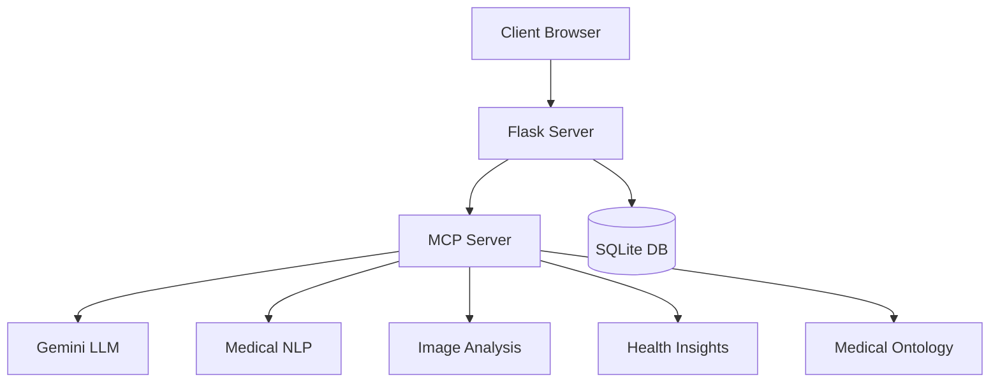

# Healthcare MCP Server Technical Documentation

## Architecture Overview

### System Components

1. **MCP Core (server.py)**
   - FastMCP server implementation
   - Authentication and authorization
   - Database models and relationships
   - RESTful API endpoints
   - WebSocket connections for real-time updates

2. **AI Models Integration**
   - Gemini LLM configuration
   - Medical NLP pipelines
   - Computer vision models
   - Embedding models for medical context

3. **Data Layer**
   - SQLite database with SQLAlchemy ORM
   - Medical ontology management
   - Patient records structure
   - Appointment scheduling system

### Component Relationships



## API Reference

### Authentication Endpoints

#### POST /login
```json
{
  "username": "string",
  "password": "string"
}
```
Response:
```json
{
  "token": "string",
  "user": {
    "id": "integer",
    "role": "string",
    "username": "string"
  }
}
```

#### POST /register
```json
{
  "username": "string",
  "email": "string",
  "password": "string",
  "role": "string"
}
```

### Medical Analysis Endpoints

#### POST /api/analyze-symptoms
```json
{
  "symptoms": ["string"],
  "patient_data": {
    "age": "integer",
    "gender": "string",
    "medical_history": "string"
  }
}
```

#### POST /api/analyze-image
```json
{
  "image": "binary",
  "type": "string",
  "context": "string"
}
```

## Database Schema

### User Table
```sql
CREATE TABLE user (
    id INTEGER PRIMARY KEY,
    username VARCHAR(80) UNIQUE NOT NULL,
    email VARCHAR(120) UNIQUE NOT NULL,
    password_hash VARCHAR(128),
    role VARCHAR(20) NOT NULL
);
```

### Patient Table
```sql
CREATE TABLE patient (
    id INTEGER PRIMARY KEY,
    user_id INTEGER NOT NULL,
    name VARCHAR(100) NOT NULL,
    dob DATE NOT NULL,
    medical_history TEXT,
    FOREIGN KEY (user_id) REFERENCES user (id)
);
```

### Doctor Table
```sql
CREATE TABLE doctor (
    id INTEGER PRIMARY KEY,
    user_id INTEGER NOT NULL,
    name VARCHAR(100) NOT NULL,
    specialization VARCHAR(100) NOT NULL,
    FOREIGN KEY (user_id) REFERENCES user (id)
);
```

## AI Models Configuration

### Gemini LLM Settings
```python
GEMINI_CONFIG = {
    "model": "gemini-2.0-flash",
    "temperature": 0.7,
    "top_p": 0.9,
    "top_k": 40,
    "safety_settings": [
        {"category": "HARM_CATEGORY_HARASSMENT", "threshold": "BLOCK_MEDIUM_AND_ABOVE"},
        {"category": "HARM_CATEGORY_HATE_SPEECH", "threshold": "BLOCK_MEDIUM_AND_ABOVE"},
        {"category": "HARM_CATEGORY_SEXUALLY_EXPLICIT", "threshold": "BLOCK_MEDIUM_AND_ABOVE"},
        {"category": "HARM_CATEGORY_DANGEROUS_CONTENT", "threshold": "BLOCK_MEDIUM_AND_ABOVE"}
    ]
}
```

### Medical NLP Pipeline
- Model: facebook/bart-large-mnli
- Max Sequence Length: 512
- Classification Categories: emergency, urgent, non-urgent, routine

### Medical Imaging Models
- Vision Model: microsoft/beit-base-patch16-224-pt22k-ft22k
- Image Size: 224x224
- Supported Formats: DICOM, JPEG, PNG, TIFF

## Development Guide

### Setting Up Development Environment

1. **Install Development Dependencies**
   ```bash
   pip install -r requirements-dev.txt
   ```

2. **Configure Pre-commit Hooks**
   ```bash
   pre-commit install
   ```

3. **Run Tests**
   ```bash
   pytest tests/
   ```

### Code Style Guide

1. **Python Style**
   - Follow PEP 8
   - Use type hints
   - Document functions with docstrings

2. **Project Structure**
   - Keep modules focused and single-purpose
   - Use relative imports within packages
   - Maintain clear separation of concerns

3. **Testing**
   - Write unit tests for all new features
   - Maintain minimum 80% code coverage
   - Mock external services in tests

### Error Handling

1. **HTTP Errors**
   - 400: Bad Request
   - 401: Unauthorized
   - 403: Forbidden
   - 404: Not Found
   - 500: Internal Server Error

2. **Custom Error Types**
   ```python
   class MedicalAnalysisError(Exception):
       pass

   class ImageProcessingError(Exception):
       pass

   class AuthenticationError(Exception):
       pass
   ```

## Deployment Guide

### Production Setup

1. **Environment Variables**
   ```
   FLASK_ENV=production
   GOOGLE_API_KEY=your-api-key
   SECRET_KEY=your-secret-key
   DATABASE_URL=your-db-url
   ```

2. **WSGI Configuration**
   ```python
   from launcher import app

   if __name__ == "__main__":
       app.run()
   ```

3. **Nginx Configuration**
   ```nginx
   server {
       listen 80;
       server_name your-domain.com;

       location / {
           proxy_pass http://localhost:5000;
           proxy_set_header Host $host;
           proxy_set_header X-Real-IP $remote_addr;
       }
   }
   ```

### Monitoring and Logging

1. **Application Logs**
   - Request/Response logging
   - Error tracking
   - Performance metrics

2. **Model Performance Monitoring**
   - Inference time tracking
   - Accuracy metrics
   - Resource utilization

3. **Health Checks**
   - Database connectivity
   - AI model availability
   - External service status

## Security Considerations

1. **Data Protection**
   - HIPAA compliance measures
   - PHI handling guidelines
   - Data encryption at rest and in transit

2. **Access Control**
   - Role-based permissions
   - Session management
   - API authentication

3. **Model Security**
   - Input validation
   - Output sanitization
   - Rate limiting

## Troubleshooting Guide

### Common Issues

1. **Database Connection Issues**
   - Check connection string
   - Verify database permissions
   - Ensure proper initialization

2. **AI Model Errors**
   - Verify API keys
   - Check model availability
   - Validate input formats

3. **Performance Issues**
   - Monitor resource usage
   - Check caching configuration
   - Optimize database queries

### Debug Tools

1. **Logging**
   ```python
   import logging
   logging.basicConfig(level=logging.DEBUG)
   ```

2. **Profiling**
   ```python
   from cProfile import Profile
   profiler = Profile()
   ```

3. **Monitoring**
   - Flask Debug Toolbar
   - SQLAlchemy Engine Logging
   - AI Model Performance Metrics